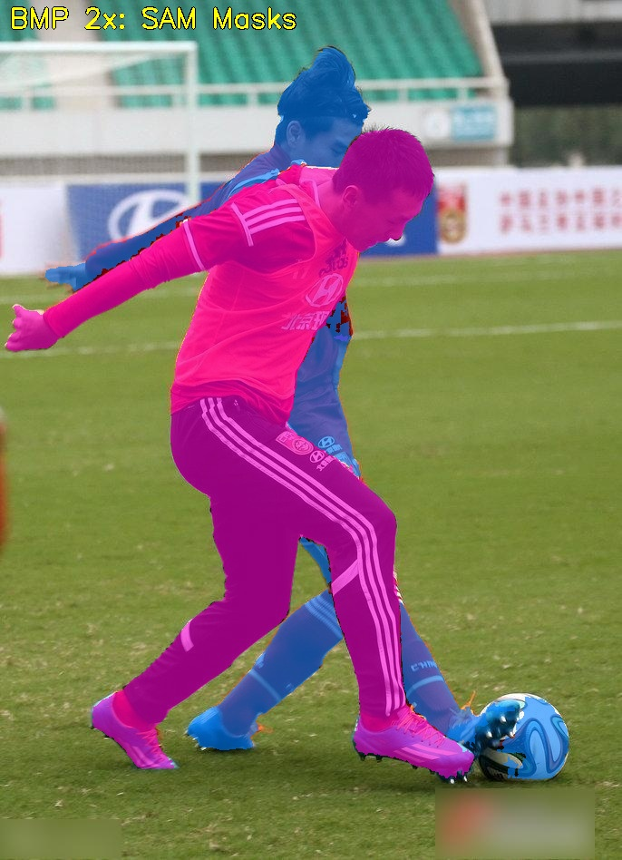
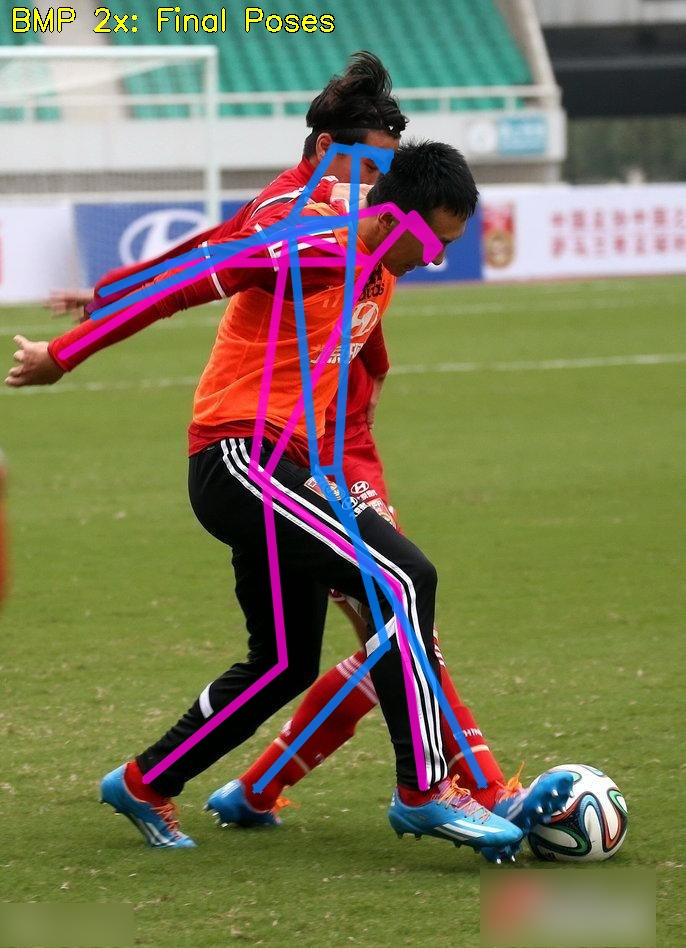

</h1><div id="toc">
  <ul align="center" style="list-style: none; padding: 0; margin: 0;">
    <summary>
      <h1 style="margin-bottom: 0.0em;">
        Detection, Pose Estimation and Segmentation for Multiple Bodies: Closing the Virtuous Circle
      </h1>
    </summary>
  </ul>
</div>
</h1><div id="toc">
  <ul align="center" style="list-style: none; padding: 0; margin: 0;">
    <summary>
      <h2 style="margin-bottom: 0.2em;">
        ICCV 2025
      </h2>
    </summary>
  </ul>
</div>

<div align="center">
  

  [](https://arxiv.org/abs/2412.01562) &nbsp;&nbsp;&nbsp;
  [](https://mirapurkrabek.github.io/BBox-Mask-Pose/) &nbsp;&nbsp;&nbsp;
  [](LICENSE) &nbsp;&nbsp;&nbsp;
  [](https://youtu.be/U05yUP4b2LQ)
  

  Papers with code:

  [](https://paperswithcode.com/sota/2d-human-pose-estimation-on-ochuman?p=detection-pose-estimation-and-segmentation-1) &nbsp;&nbsp;
  [](https://paperswithcode.com/sota/human-instance-segmentation-on-ochuman?p=detection-pose-estimation-and-segmentation-1)  

</div>


## 📋 Overview

The BBox-Mask-Pose (BMP) method integrates detection, pose estimation, and segmentation into a self-improving loop by conditioning these tasks on each other. This approach enhances all three tasks simultaneously. Using segmentation masks instead of bounding boxes improves performance in crowded scenarios, making top-down methods competitive with bottom-up approaches.

Key contributions:
1. **MaskPose**: a pose estimation model conditioned by segmentation masks instead of bounding boxes, boosting performance in dense scenes without adding parameters
    - Download pre-trained weights below
2. **BBox-MaskPose (BMP)**: method linking bounding boxes, segmentation masks, and poses to simultaneously address multi-body detection, segmentation and pose estimation
    - Try the demo!
3. Fine-tuned RTMDet adapted for itterative detection (ignoring 'holes')
    - Download pre-trained weights below
5. Support for multi-dataset training of ViTPose, previously implemented in the official ViTPose repository but absent in MMPose.

For more details, please visit our [project website](https://mirapurkrabek.github.io/BBox-Mask-Pose/).


## 📢 News

- **Jul 2025**: Version 1.1 with easy-to-run image demo released
- **Jun 2025**: Paper accepted to ICCV 2025! 🎉
- **Dec 2024**: The code is available
- **Nov 2024**: The [project website](https://MiraPurkrabek.github.io/BBox-Mask-Pose) is on


## 🚀 Installation
  
This project is built on top of [MMPose](https://github.com/open-mmlab/mmpose) and [SAM 2.1](https://github.com/facebookresearch/sam2).
Please refer to the [MMPose installation guide](https://mmpose.readthedocs.io/en/latest/installation.html) or [SAM installation guide](https://github.com/facebookresearch/sam2/blob/main/INSTALL.md) for detailed setup instructions.

Basic installation steps:
```bash
# Clone the repository
git clone https://github.com/mirapurkrabek/BBoxMaskPose.git BBoxMaskPose/
cd BBoxMaskPose

# Install your version of torch, torchvision, OpenCV and NumPy
pip install torch==2.1.2+cu121 torchvision==0.16.2+cu121 --extra-index-url https://download.pytorch.org/whl/cu121
pip install numpy==1.25.1 opencv-python==4.9.0.80

# Install MMLibrary
pip install -U openmim
mim install mmengine "mmcv==2.1.0" "mmdet==3.3.0" "mmpretrain==1.2.0"

# Install dependencies
pip install -r requirements.txt
pip install -e .
```

## 🎮 Demo

Step 1: Download SAM2 weights using the [enclosed script](models/SAM/download_ckpts.sh).

Step 2: Run the full BBox-Mask-Pose pipeline on an input image:

```bash
python demo/bmp_demo.py configs/bmp_D3.yaml data/004806.jpg
```

It will take an image 004806.jpg from OCHuman and run (1) detector, (2) pose estimator and (3) SAM2 refinement. 
Details are in the cofiguration file [bmp_D3.yaml](configs/bmp_D3.yaml).

Options:
- `configs/bmp_D3.yaml`: BMP configuration file
- `data/004806.jpg`: Input image
- `--device`: (Optional) Inference device (default: `cuda:0`)
- `--output-root`: (Optional) Directory to save outputs (default: `demo/outputs`)
- `--create-gif`: (Optional) Generate an animated GIF of all iterations (default `False`)

After running, outputs are in `outputs/004806/`. The expected output should look like this:
<div align="center">
  <a href="images/004806_mask.jpg" target="_blank">
    
  </a>
  &nbsp&nbsp&nbsp&nbsp
  <a href="images/004806_pose.jpg" target="_blank">
    
  </a>
</div>


## 📦 Pre-trained Models

Pre-trained models are available on [VRG Hugging Face 🤗](https://huggingface.co/vrg-prague/BBoxMaskPose/).
To run the demo, you only need do download SAM weights with [enclosed script](models/SAM/download_ckpts.sh).
Our detector and pose estimator will be downloaded during the runtime.

If you want to download our weights yourself, here are the links to our HuggingFace:
- ViTPose-b trained on COCO+MPII+AIC -- [download weights](https://huggingface.co/vrg-prague/BBoxMaskPose/resolve/main/ViTPose-b-multi_mmpose20.pth)
- MaskPose-b -- [download weights](https://huggingface.co/vrg-prague/BBoxMaskPose/resolve/main/MaskPose-b.pth)
- Fine-tuned RTMDet-L -- [download weights](https://huggingface.co/vrg-prague/BBoxMaskPose/resolve/main/rtmdet-ins-l-mask.pth)

## 🙏 Acknowledgments

The code combines [MMDetection](https://github.com/open-mmlab/mmdetection), [MMPose 2.0](https://github.com/open-mmlab/mmpose), [ViTPose](https://github.com/ViTAE-Transformer/ViTPose) and [SAM 2.1](https://github.com/facebookresearch/sam2).

## 📝 Citation

The code was implemented by [Miroslav Purkrábek]([htt]https://mirapurkrabek.github.io/).
If you use this work, kindly cite it using the reference provided below.

For questions, please use the Issues of Discussion.

```
@InProceedings{Purkrabek2025ICCV,
  author={Purkrabek, Miroslav and Matas, Jiri},
  title={Detection, Pose Estimation and Segmentation for Multiple Bodies: Closing the Virtuous Circle}, 
  booktitle={Proceedings of the IEEE/CVF International Conference on Computer Vision},
  year={2025},
  month={October},
}
```
