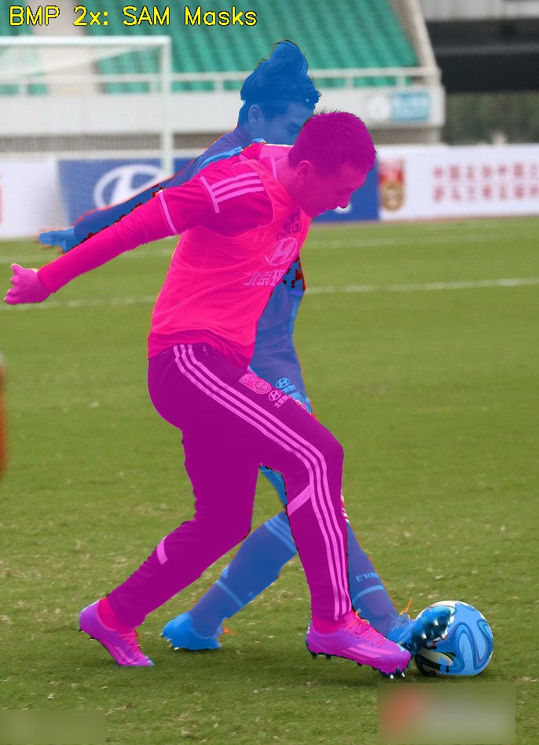
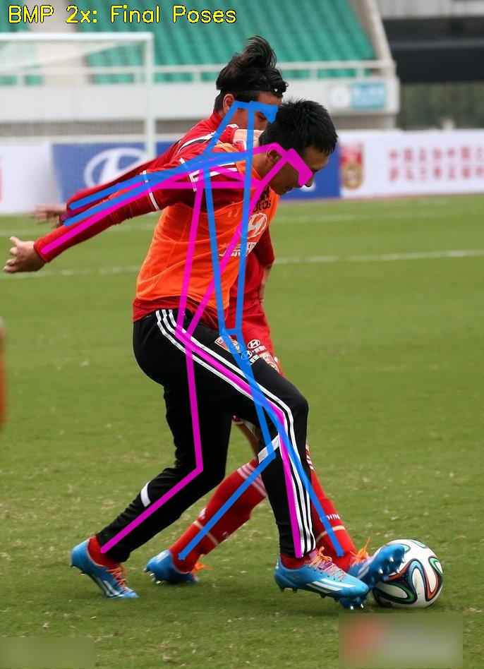

</h1><div id="toc">
  <ul align="center" style="list-style: none; padding: 0; margin: 0;">
    <summary>
      <h1 style="margin-bottom: 0.0em;">
        BBoxMaskPose v2
      </h1>
    </summary>
  </ul>
</div>
</h1><div id="toc">
  <ul align="center" style="list-style: none; padding: 0; margin: 0;">
    <summary>
      <h2 style="margin-bottom: 0.2em;">
        CVPR 2025 + ICCV 2025 
      </h2>
    </summary>
  </ul>
</div>

<div align="center">
  

  [](https://mirapurkrabek.github.io/BBox-Mask-Pose/) &nbsp;&nbsp;&nbsp;
  [](LICENSE) &nbsp;&nbsp;&nbsp;
  [](https://youtu.be/U05yUP4b2LQ)
  
  [](https://arxiv.org/abs/2412.02254) &nbsp;&nbsp;&nbsp;
  [](https://arxiv.org/abs/2412.01562) &nbsp;&nbsp;&nbsp;
  [](https://arxiv.org/abs/2601.08982) &nbsp;&nbsp;&nbsp;
  [](https://arxiv.org/abs/2601.15200) &nbsp;&nbsp;&nbsp;


  <!-- Papers with code:
  [](https://paperswithcode.com/sota/2d-human-pose-estimation-on-ochuman?p=detection-pose-estimation-and-segmentation-1) &nbsp;&nbsp;
  [](https://paperswithcode.com/sota/human-instance-segmentation-on-ochuman?p=detection-pose-estimation-and-segmentation-1)   -->

</div>

> [!CAUTION] 
> This branch is a **work in progress**!
>
> Until merged with <code>main</code>, use on your own discretion. For stable version, please refer to <code>main</code> branch with BMPv1.

## 📢 News

- **Feb 2026**: Version 2.0 with improved (1) pose and (2) SAM and (3) wiring to 3D prediction released. 
- **Feb 2026**: SAM-pose2seg won a Best Paper Award on CVWW 2026 🎉
- **Jan 2026**: [BMPv2 paper](https://arxiv.org/abs/2601.15200) is available on arXiv
- **Aug 2025**: [HuggingFace Image Demo](https://huggingface.co/spaces/purkrmir/BBoxMaskPose-demo) is out! 🎮
- **Jul 2025**: Version 1.1 with easy-to-run image demo released
- **Jun 2025**: BMPv1 paper accepted to ICCV 2025! 🎉
- **Dec 2024**: BMPv1 code is available
- **Nov 2024**: The [project website](https://MiraPurkrabek.github.io/BBox-Mask-Pose) is on

## 📑 Table of Contents

- [Installation](#-installation)
- [Demo](#-demo)
- [API Examples](#api-examples)
- [Pre-trained Models](#-pre-trained-models)
- [Acknowledgments](#-acknowledgments)
- [Citation](#-citation)


## 📋 Project Overview

Bounding boxes, masks, and poses capture complementary aspects of the human body. BBoxMaskPose links detection, segmentation, and pose estimation iteratively, where each prediction refines the others. PMPose combines probabilistic modeling with mask conditioning for robust pose estimation in crowds. Together, these components achieve state-of-the-art results on COCO and OCHuman, being the first method to exceed 50 AP on OCHuman.


### Repository Structure

The repository is organized into two main packages with stable public APIs:

```
BBoxMaskPose/
├── pmpose/                    # PMPose package (pose estimation)
│   └── pmpose/
│       ├── api.py             # PUBLIC API: PMPose class
│       ├── mm_utils.py        # Internal utilities
│       └── posevis_lite.py    # Visualization
├── mmpose/                    # MMPose fork with our edits
├── bboxmaskpose/              # BBoxMaskPose package (full pipeline)
│   └── bboxmaskpose/
│       ├── api.py             # PUBLIC API: BBoxMaskPose class
│       ├── sam2/              # SAM2 implementation
│       ├── configs/           # BMP configurations
│       └── *_utils.py         # Internal utilities
├── demos/                     # Public API demos
│   ├── PMPose_demo.py         # PMPose usage example
│   ├── BMP_demo.py            # BBoxMaskPose usage example
│   └── quickstart.ipynb       # Interactive notebook
└── demo/                      # Legacy demo (still functional)
```

Key contributions:
1. **MaskPose**: a pose estimation model conditioned by segmentation masks instead of bounding boxes, boosting performance in dense scenes without adding parameters
    - Download pre-trained weights below
2. **BBox-MaskPose (BMP)**: method linking bounding boxes, segmentation masks, and poses to simultaneously address multi-body detection, segmentation and pose estimation
    - Try the demo!
3. Fine-tuned RTMDet adapted for itterative detection (ignoring 'holes')
    - Download pre-trained weights below
4. Support for multi-dataset training of ViTPose, previously implemented in the official ViTPose repository but absent in MMPose.

For more details, please visit our [project website](https://mirapurkrabek.github.io/BBox-Mask-Pose/).


## 🚀 Installation

### Docker Installation (Recommended)

The fastest way to get started with GPU support:

```bash
# Clone and build
git clone https://github.com/mirapurkrabek/BBoxMaskPose.git
cd BBoxMaskPose
docker-compose build

# Run the demo
docker-compose up
```

Requires: Docker Engine 19.03+, [NVIDIA Container Toolkit](https://docs.nvidia.com/datacenter/cloud-native/container-toolkit/install-guide.html), NVIDIA GPU with CUDA 12.1 support.

### Manual Installation
  
This project is built on top of [MMPose](https://github.com/open-mmlab/mmpose) and [SAM 2.1](https://github.com/facebookresearch/sam2).
Please refer to the [MMPose installation guide](https://mmpose.readthedocs.io/en/latest/installation.html) or [SAM installation guide](https://github.com/facebookresearch/sam2/blob/main/INSTALL.md) for detailed setup instructions.

Basic installation steps:
```bash
# Clone the repository
git clone https://github.com/mirapurkrabek/BBoxMaskPose.git BBoxMaskPose/
cd BBoxMaskPose

# Install your version of torch, torchvision, OpenCV and NumPy
pip install torch==2.1.2+cu121 torchvision==0.16.2+cu121 --extra-index-url https://download.pytorch.org/whl/cu121
pip install numpy==1.25.1 opencv-python==4.9.0.80

# Install MMLibrary
pip install -U openmim
mim install mmengine "mmcv==2.1.0" "mmdet==3.3.0" "mmpretrain==1.2.0"

# Install dependencies
pip install -r requirements.txt
pip install -e .
```

## 🎮 Demo

#### PMPose Demo (Pose Estimation Only)
```bash
python demos/PMPose_demo.py --image data/004806.jpg --device cuda
```

#### BBoxMaskPose Demo (Full Pipeline)
```bash
python demos/BMP_demo.py --image data/004806.jpg --device cuda
```

After running the demo, outputs are in `outputs/004806/`. The expected output should look like this:
<div align="center">
  <a href="data/assets/004806_mask.jpg" target="_blank">
    
  </a>
  &nbsp&nbsp&nbsp&nbsp
  <a href="data/assets/004806_pose.jpg" target="_blank">
    
  </a>
</div>

#### BBoxMaskPose v2 Demo (Full Pipeline + 3D Mesh Recovery)
This demo extends BMP with [SAM-3D-Body](https://github.com/facebookresearch/sam-3d-body) for 3D human mesh recovery:
```bash
# Basic usage (auto-downloads checkpoint from HuggingFace)
python demos/BMPv2_demo.py --image data/004806.jpg --device cuda

# With local checkpoint
python demos/BMPv2_demo.py --image data/004806.jpg --device cuda \
    --sam3d_checkpoint checkpoints/sam-3d-body-dinov3/model.ckpt \
    --mhr_path checkpoints/sam-3d-body-dinov3/assets/mhr_model.pt
```

**SAM-3D-Body Installation (Optional):**
BMPv2 requires SAM-3D-Body for 3D mesh recovery. Install it separately:
```bash
# 1. Install dependencies
pip install -r requirements/sam3d.txt

# 2. Install detectron2
pip install 'git+https://github.com/facebookresearch/detectron2.git@a1ce2f9' --no-build-isolation --no-deps

# 3. Install MoGe (optional, for FOV estimation)
pip install git+https://github.com/microsoft/MoGe.git

# 4. Install adapted SAM-3D-Body repository
pip install git+https://github.com/MiraPurkrabek/sam-3d-body.git

# 5. Request access to checkpoints at https://huggingface.co/facebook/sam-3d-body-dinov3
```

For more details, see [SAM-3D-Body installation guide](https://github.com/facebookresearch/sam-3d-body/blob/main/INSTALL.md).

#### Jupyter Notebook
Interactive demo with both PMPose and BBoxMaskPose:
```bash
jupyter notebook demos/quickstart.ipynb
```

## API Examples

**PMPose API** - Pose estimation with bounding boxes:
```python
from pmpose import PMPose

# Initialize model
pose_model = PMPose(device="cuda", from_pretrained=True)

# Run inference
keypoints, presence, visibility, heatmaps = pose_model.predict(
    image="demo/data/004806.jpg",
    bboxes=[[100, 100, 300, 400]],  # [x1, y1, x2, y2]
)

# Visualize
vis_img = pose_model.visualize(image="demo/data/004806.jpg", keypoints=keypoints)
```

**BBoxMaskPose API** - Full detection + pose + segmentation:

```python
from pmpose import PMPose
from bboxmaskpose import BBoxMaskPose

# Create pose model
pose_model = PMPose(device="cuda", from_pretrained=True)

# Inject into BMP
bmp_model = BBoxMaskPose(config="BMP_D3", device="cuda", pose_model=pose_model)
result = bmp_model.predict(image="demo/data/004806.jpg")

# Visualize
vis_img = bmp_model.visualize(image="demo/data/004806.jpg", result=result)
```


## 📦 Pre-trained Models

Pre-trained models are available on [VRG Hugging Face 🤗](https://huggingface.co/vrg-prague/BBoxMaskPose/).
To run the demo, you only need do download SAM weights with [enclosed script](models/SAM/download_ckpts.sh).
Our detector and pose estimator will be downloaded during the runtime.

If you want to download our weights yourself, here are the links to our HuggingFace:
- ViTPose-b trained on COCO+MPII+AIC -- [download weights](https://huggingface.co/vrg-prague/BBoxMaskPose/resolve/main/ViTPose-b-multi_mmpose20.pth)
- MaskPose-b -- [download weights](https://huggingface.co/vrg-prague/BBoxMaskPose/resolve/main/MaskPose-b.pth)
- Fine-tuned RTMDet-L -- [download weights](https://huggingface.co/vrg-prague/BBoxMaskPose/resolve/main/rtmdet-ins-l-mask.pth)

## 🙏 Acknowledgments

The code combines [MMDetection](https://github.com/open-mmlab/mmdetection), [MMPose 2.0](https://github.com/open-mmlab/mmpose), [ViTPose](https://github.com/ViTAE-Transformer/ViTPose), [SAM 2.1](https://github.com/facebookresearch/sam2) and [SAM-3D-Body](https://github.com/facebookresearch/sam-3d-body).

Our visualizations integrate [Distinctipy](https://github.com/alan-turing-institute/distinctipy) for automatic color selection.

This repository combines our work on BBoxMaskPose project with our previous work on [probabilistic 2D human pose estimation modelling](https://mirapurkrabek.github.io/ProbPose/).

## 📝 Citation

The code was implemented by [Miroslav Purkrábek](https://mirapurkrabek.github.io/) and Constantin Kolomiiets.
If you use this work, kindly cite it using the references provided below.

For questions, please use the Issues of Discussion.

```
@InProceedings{Purkrabek2025BMPv1,
    author    = {Purkrabek, Miroslav and Matas, Jiri},
    title     = {Detection, Pose Estimation and Segmentation for Multiple Bodies: Closing the Virtuous Circle},
    booktitle = {Proceedings of the IEEE/CVF International Conference on Computer Vision (ICCV)},
    month     = {October},
    year      = {2025},
    pages     = {9004-9013}
}
```

```
@InProceedings{Purkrabek2026BMPv2,
    author    = {Purkrabek, Miroslav and Kolomiiets, Constantin and Matas, Jiri},
    title     = {BBoxMaskPose v2: Expanding Mutual Conditioning to 3D},
    booktitle = {arXiv preprint arXiv:2601.15200},
    year      = {2026}
}
```

```
@article{yang2025sam3dbody,
  title={SAM 3D Body: Robust Full-Body Human Mesh Recovery},
  author={Yang, Xitong and Kukreja, Devansh and Pinkus, Don and Sagar, Anushka and Fan, Taosha and Park, Jinhyung and Shin, Soyong and Cao, Jinkun and Liu, Jiawei and Ugrinovic, Nicolas and Feiszli, Matt and Malik, Jitendra and Dollar, Piotr and Kitani, Kris},
  journal={arXiv preprint; identifier to be added},
  year={2025}
}
```

```
@InProceedings{Kolomiiets2026CVWW,
    author    = {Kolomiiets, Constantin and Purkrabek, Miroslav and Matas, Jiri},
    title     = {SAM-pose2seg: Pose-Guided Human Instance Segmentation in Crowds},
    booktitle = {Computer Vision Winter Workshop (CVWW)},
    year      = {2026}
}
```
